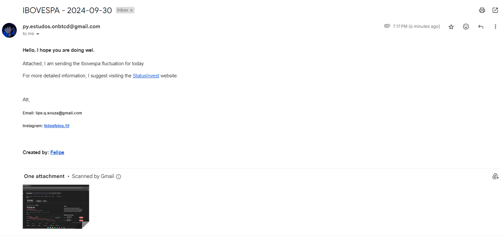

## Projeto de Automação de E-mails com python

**Perante mais uma aula na Trilha de Automações em Python
Desenvolvi este pequeno projeto, que consiste em tirar uma print de forma totalmente automatizada
e enviar via email.**

### Recursos Utilizados:
- Python: 
    - Bibliotecas Built-In:
        - email.message
        - ssl
        - smtplib
        - mimetypes
        - datetime
        - time
    - Biblicotecas Externas:
        - pyautogui
- HTML
- CSS

## Resultado de Exemplo:
